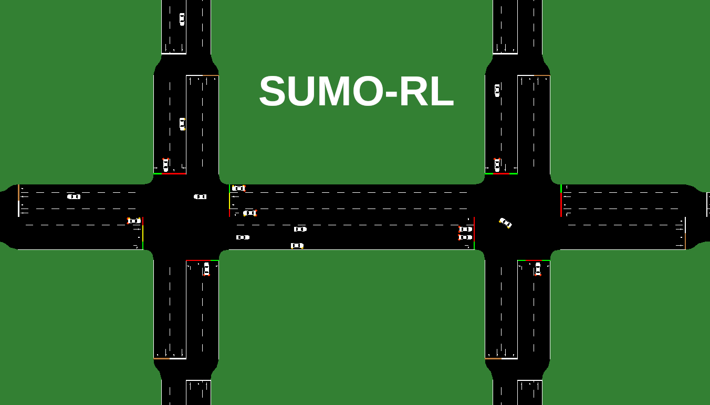
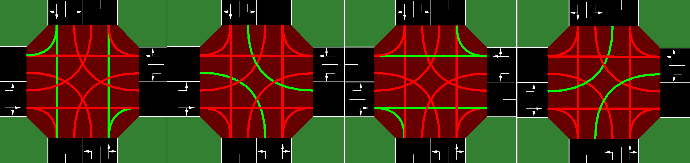
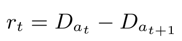
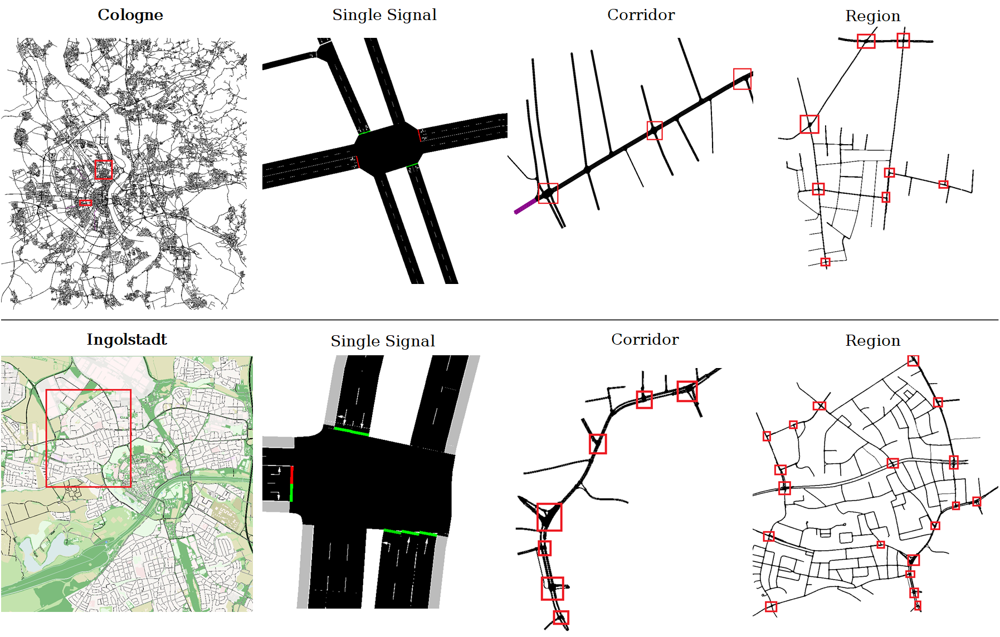
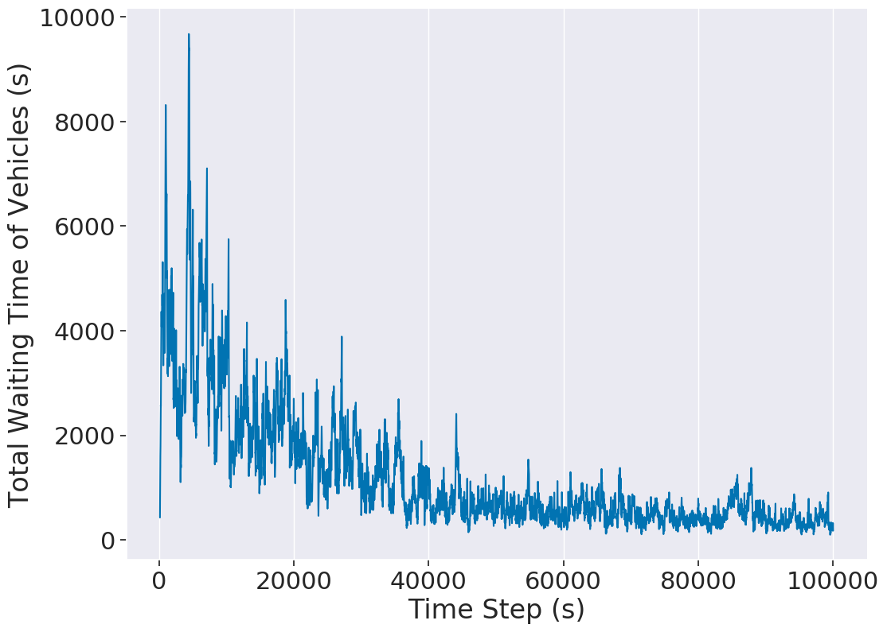

[](https://zenodo.org/doi/10.5281/zenodo.10869789)
[](https://github.com/LucasAlegre/sumo-rl/actions/workflows/linux-test.yml)
[](https://badge.fury.io/py/sumo-rl)
[](https://pre-commit.com/)
[](https://github.com/psf/black)
[](https://github.com/LucasAlegre/sumo-rl/blob/main/LICENSE)

# SUMO-RL

<!-- start intro -->

SUMO-RL 提供了一个简单的界面，可以使用 [SUMO](https://github.com/eclipse/sumo) 实例化强化学习 (RL) 环境以进行交通信号控制。

此存储库的目标：
- 提供一个简单的界面，以便使用 SUMO 进行交通信号控制的强化学习
- 支持多智能体强化学习
- 与 gymnasium.Env 以及流行的 RL 库（例如 [stable-baselines3](https://github.com/DLR-RM/stable-baselines3) 和 [RLlib](https://docs.ray.io/en/main/rllib.html) ）兼容 
- 轻松定制：状态和奖励定义可轻松修改

主类是 [SumoEnvironment](https://github.com/LucasAlegre/sumo-rl/blob/main/sumo_rl/environment/env.py) 。如果使用参数`single-agent=True`进行实例化，其行为将与常规的 [Gymnasium Env](https://github.com/Farama-Foundation/Gymnasium) 类似。对于多智能体环境，请使用 [env](https://github.com/LucasAlegre/sumo-rl/blob/main/sumo_rl/environment/env.py) 或 [parallel_env](https://github.com/LucasAlegre/sumo-rl/blob/main/sumo_rl/environment/env.py) 分别通过 AEC 或 Parallel API 实例化 [PettingZoo](https://github.com/PettingZoo-Team/PettingZoo) 环境。[TrafficSignal](https://github.com/LucasAlegre/sumo-rl/blob/main/sumo_rl/environment/traffic_signal.py) 负责检索信息并使用 [TraCI](https://sumo.dlr.de/wiki/TraCI) API 触发交通信号灯。


欲了解更多详细信息，请查看 [在线文档](https://lucasalegre.github.io/sumo-rl/) 。

<!-- end intro -->

## 安装

<!-- start install -->

### 安装 SUMO 最新版本：

```bash
sudo add-apt-repository ppa:sumo/stable
sudo apt-get update
sudo apt-get install sumo sumo-tools sumo-doc
```
不要忘记设置 SUMO_HOME 变量（默认 sumo 安装路径是 `/usr/share/sumo`）
```bash
echo 'export SUMO_HOME="/usr/share/sumo"' >> ~/.bashrc
source ~/.bashrc
```
重要提示：为了使用 Libsumo 获得巨大的性能提升（~8 倍），您可以声明变量：
```bash
export LIBSUMO_AS_TRACI=1
```
请注意，如果此功能（Libsumo）处于活动状态，您将无法使用 sumo-gui 或并行运行多个模拟（ [更多详细信息](https://sumo.dlr.de/docs/Libsumo.html) ）。

### 安装 SUMO-RL

稳定发布版本可通过 pip 获取
```bash
pip install sumo-rl
```

或者，您可以使用最新（未发布）版本进行安装
```bash
git clone https://github.com/LucasAlegre/sumo-rl
cd sumo-rl
pip install -e .
```

<!-- end install -->

## 马尔可夫决策过程（MDP） - 观测（Observations）, 动作（Actions）和奖励（Rewards）

### 观测

<!-- start observation -->

每个交通信号代理的默认观测是一个向量：
```python
    obs = [phase_one_hot, min_green, lane_1_density,...,lane_n_density, lane_1_queue,...,lane_n_queue]
```
- ```phase_one_hot``` 是一个单热编码向量，指示当前活跃的绿灯相位
- ```min_green```（是否超过最小绿灯秒数）是一个二进制变量，表示当前相位是否已经过了 min_green 秒数
- ```lane_i_density```（车道i的密度）是迎面驶来的车道 i 中的车辆数量除以该车道的总容量
- ```lane_i_queue``` 是进入车道 i 的排队车辆数（速度低于 0.1 米/秒）除以车道总容量

您可以通过实现从 [ObservationFunction](https://github.com/LucasAlegre/sumo-rl/blob/main/sumo_rl/environment/observations.py) 继承的类并将其传递给环境构造函数来定义自己的观测。

<!-- end observation -->

### 动作

<!-- start action -->

动作空间是离散的。每隔 `delta_time` 秒，每个交通信号代理可以选择下一个绿灯相位配置。

例如：在 [双向单交叉路口](https://github.com/LucasAlegre/sumo-rl/blob/main/experiments/dqn_2way-single-intersection.py) ，有 |A| = 4 个离散动作（分别为南北方向直行和右转、南北方向左转、东西方向的直行和右转、东西方向左转），对应以下绿灯相位配置：

<p align="center">

</p>

重要提示：每次发生阶段变化时，下一个相位都会先于持续 `yellow_time` 秒的黄色相位（一般为3秒）。

<!-- end action -->

### 奖励

<!-- start reward -->

默认奖励函数是累积车辆延误的变化：

<p align="center">

</p>

也就是说，奖励是总延迟（所有接近车辆的等待时间的总和）相对于前一个时间步的变化量。

您可以在 [SumoEnvironment](https://github.com/LucasAlegre/sumo-rl/blob/main/sumo_rl/environment/env.py) 构造函数中使用参数 `reward_fn` 选择不同的奖励函数（参见 [TrafficSignal](https://github.com/LucasAlegre/sumo-rl/blob/main/sumo_rl/environment/traffic_signal.py) 中实现的奖励函数）。

您也可以实现自己的奖励函数：

```python
def my_reward_fn(traffic_signal):
    return traffic_signal.get_average_speed()

env = SumoEnvironment(..., reward_fn=my_reward_fn)
```

<!-- end reward -->

## API (Gymnasium 和 PettingZoo)

### Gymnasium 单代理 API

<!-- start gymnasium -->

如果您的网络只有一个交通灯，那么您可以实例化一个标准的 Gymnasium 环境（请参阅 [Gymnasium API](https://gymnasium.farama.org/api/env/) ）：

```python
import gymnasium as gym
import sumo_rl
env = gym.make('sumo-rl-v0',
                net_file='path_to_your_network.net.xml',
                route_file='path_to_your_routefile.rou.xml',
                out_csv_name='path_to_output.csv',
                use_gui=True,
                num_seconds=100000)
obs, info = env.reset()
done = False
while not done:
    next_obs, reward, terminated, truncated, info = env.step(env.action_space.sample())
    done = terminated or truncated
```

<!-- end gymnasium -->

### PettingZoo 多代理 API

<!-- start pettingzoo -->

对于多代理环境，您可以使用 PettingZoo API（参见 [Petting Zoo API](https://pettingzoo.farama.org/api/parallel/) ）：

```python
import sumo_rl
env = sumo_rl.parallel_env(net_file='nets/RESCO/grid4x4/grid4x4.net.xml',
                  route_file='nets/RESCO/grid4x4/grid4x4_1.rou.xml',
                  use_gui=True,
                  num_seconds=3600)
observations = env.reset()
while env.agents:
    actions = {agent: env.action_space(agent).sample() for agent in env.agents}  # 您可以在此处插入您的策略
    observations, rewards, terminations, truncations, infos = env.step(actions)
```

<!-- end pettingzoo -->

### RESCO 基准测试

在 [nets/RESCO](https://github.com/LucasAlegre/sumo-rl/tree/main/sumo_rl/nets/RESCO) 文件夹中，您可以找到 [RESCO](https://github.com/jault/RESCO) （交通信号控制强化学习基准）的网络和路由文件，该基准基于 SUMO-RL 构建。请参阅其 [论文](https://people.engr.tamu.edu/guni/Papers/NeurIPS-signals.pdf) 了解结果。

<p align="center">

</p>

### 实验

检查 [实验](https://github.com/LucasAlegre/sumo-rl/tree/main/experiments) 以获取有关如何实例化环境和训练 RL 代理的示例。

### 单向单路口的 [Q 学习](https://github.com/LucasAlegre/sumo-rl/blob/main/agents/ql_agent.py) ： 
```bash
python experiments/ql_single-intersection.py
```

### 4x4 网格中的 [RLlib PPO](https://docs.ray.io/en/latest/_modules/ray/rllib/algorithms/ppo/ppo.html) 多智能体：
```bash
python experiments/ppo_4x4grid.py
```

### 双向单路交叉口中的 [stable-baselines3 DQN](https://github.com/DLR-RM/stable-baselines3/blob/master/stable_baselines3/dqn/dqn.py) ：
注意：为了与 [Gymnasium 兼容](https://stable-baselines3.readthedocs.io/en/master/guide/install.html) ，您需要使用 ```pip install "stable_baselines3[extra]>=2.0.0a9"``` 安装 stable-baselines3。
```bash
python experiments/dqn_2way-single-intersection.py
```

### 绘制结果：
```bash
python outputs/plot.py -f outputs/4x4grid/ppo_conn0_ep2
```
<p align="center">

</p>

## 引用

<!-- start citation -->

```bibtex
@misc{sumorl,
    author = {Lucas N. Alegre},
    title = {{SUMO-RL}},
    year = {2019},
    publisher = {GitHub},
    journal = {GitHub repository},
    howpublished = {\url{https://github.com/LucasAlegre/sumo-rl}},
}
```

<!-- end citation -->

<!-- start list of publications -->

使用 SUMO-RL 的出版物列表：
- [量化基于强化学习的交通信号控制中非平稳性的影响 (Alegre et al., 2021)](https://peerj.com/articles/cs-575/)
- [多视图强化学习的信息论状态空间模型 (Hwang et al., 2023)](https://openreview.net/forum?id=jwy77xkyPt)
- [基于TD学习的城市自动驾驶汽车智能交通信号控制：使用SUMO进行性能评估 (Reza et al., 2023)](https://onlinelibrary.wiley.com/doi/full/10.1111/exsy.13301)
- [处理自适应系统中的不确定性：基于本体的强化学习模型 (Ghanadbashi et al., 2023)](https://link.springer.com/article/10.1007/s40860-022-00198-x)
- [多智能体强化学习在交通信号控制中的应用：基于k近邻的方法 (Almeida et al., 2022)](https://ceur-ws.org/Vol-3173/3.pdf)
- [从本地到全局：基于强化学习的交通信号控制课程学习方法 (Zheng et al., 2022)](https://ieeexplore.ieee.org/abstract/document/9832372)
- [海报：通过多模态强化学习实现可靠的入口匝道合并 (Bagwe et al., 2022)](https://ieeexplore.ieee.org/abstract/document/9996639)
- [使用本体来指导强化学习代理在未知情况下的表现 (Ghanadbashi & Golpayegani, 2022)](https://link.springer.com/article/10.1007/s10489-021-02449-5)
- [信息向上，推荐向下：交通信号控制的层次强化学习 (Antes et al., 2022)](https://www.sciencedirect.com/science/article/pii/S1877050922004185)
- [智能交通信号控制算法比较研究 (Chaudhuri et al., 2022)](https://link.springer.com/chapter/10.1007/978-981-16-7996-4_19)
- [基于本体的智能交通信号控制模型 (Ghanadbashi & Golpayegani, 2021)](https://ieeexplore.ieee.org/abstract/document/9564962)
- [交通信号控制的强化学习基准 (Ault & Sharon, 2021)](https://openreview.net/forum?id=LqRSh6V0vR)
- [EcoLight：深度强化学习中的奖励塑造，用于人体工程学交通信号控制 (Agand et al., 2021)](https://s3.us-east-1.amazonaws.com/climate-change-ai/papers/neurips2021/43/paper.pdf)

<!-- end list of publications -->
